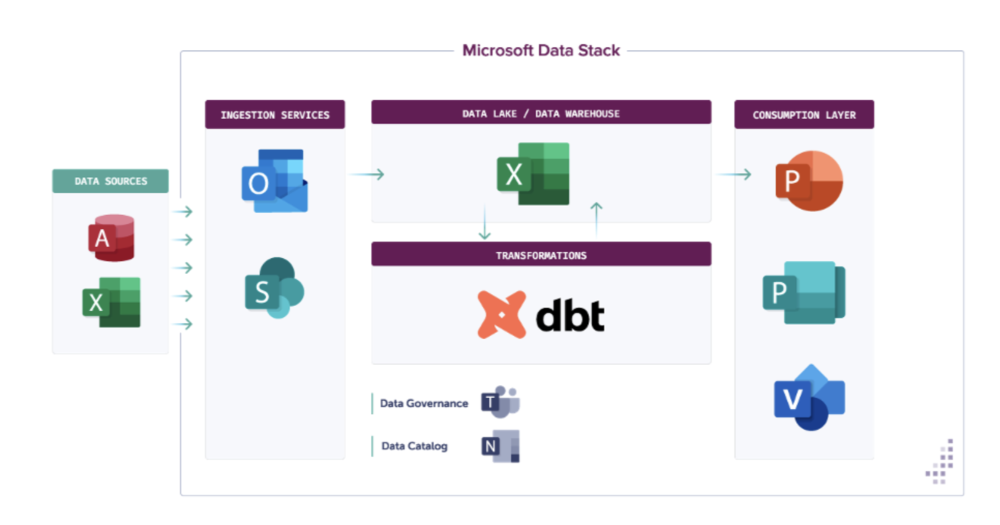

# :no_entry: [DEPRECATED] `dbt-excel` is not supported use `dbt-duckdb` instead

[dbt-excel](https://dbt-excel.com/) was an April fools joke. Though, the joke
inspired adding Excel capabilities to `dbt-duckdb`. If you would like to use
`dbt-excel`, use [`dbt-duckdb`](https://github.com/jwills/dbt-duckdb) with the
plugins capabilities to read from and write to Excel files.

# dbt-excel: Unleash the Power of Excel in Your Data Stack

## The ultimate solution for the data-driven world

Welcome to dbt-excel, the revolutionary dbt adapter that combines the rigor of dbt with the flexibility and familiarity of Excel. Get ready to change the way you look at data analytics forever.



### Features

- Integrate Excel with dbt: query data that you didn't know existed, for people who didn't know you existed, all from Excel!
- Use your favorite Excel functions: VLOOKUP, sheet support, averageif, and more, because life's too short for learning SQL functions.
- Runs blazingly fast queries thanks to duckdb running in the background, so you can have your cake and eat it too!
- Monitor your data assets, collaborate on data models, and document your queries, all within Excel. Remember, if it's not in Excel, it's not worth doing!

### **Installation**

To install dbt-excel, just run the following command in your terminal:

```bash
python -m pip install dbt-excel
```

### **Development Installation**

This section details how to setup a local environment to develop this dbt adapter.

1. Clone this repo to your local machine and change directory:
    ```bash
    git clone git@github.com:godatadriven/dbt-excel.git
    cd dbt-excel
    ```

1. Create a virtual environment:
    ```bash
    python -m virtualenv .venv
    source .venv/bin/activate
    ```

1. To install dbt-excel in editable mode, run the following command in your terminal:
    ```bash
    python -m pip install -e .
    ```

#### Profile setup

The default profile will create a duckdb file in /tmp, of the custom `excel` type. You can adjust the path if necessary.

```
dbt_excel:
  target: dev
  outputs:
   dev:
     type: excel
     path: /tmp/dbt.duckdb

```


### Running your first DBT Excel model

Steps:

1. `cd` into the `dbt_project` directory, then run `dbt run -s my_first_dbt_model --profiles-dir .` this will run the models in the `models/example/my_first_dbt_model.sql` file.
2. A Excel file exists in `sources/people.xlsx`, which will be read and used by the models. The result will be written to ` first_model.xlsx`.
3. Boom, you just read from AND wrote to Excel!
4. Savour this moment, it's precious.

### Testimonials:

**Enterprise Architect:**

> As an Enterprise Architect, I have been involved in countless failed digital transformation projects. They all make the same mistake. They forget one thing: all data lives in Excel. By moving away from enterprise-grade solutions like Excel to complicated stacks based on FivetPython, dbt and XXX, companies neglect their core competence. 1,048,576 rows ought to be enough for anybody. The only digital winners are the companies that build their stack on top of Excel.

**CEO:**

> Companies worldwide are pouring trillions of dollars into digital transformation. But they forget one thing. In the end, all data lives in Excel. Dbt-excel combines the rigour of software engineering from dbt with the flexibility of Excel. True data democratization starts and ends with Excel.

**Anonymous Analyst:**
> I used to have impostor syndrome working with DBT. With Excel I know I Excel.


### Credits

Big credits to [Josh Wills' excellent DBT Duckdb adapter](https://github.com/jwills/dbt-duckdb) which inspired this project!
